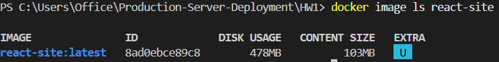
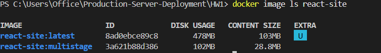

### Описание домашнего задания

Первый вариант Dockerfile:

```dockerfile
FROM node:22-alpine

WORKDIR /app

COPY package*.json ./

RUN npm install

COPY . .

RUN npm run build

RUN npm install -g serve

EXPOSE 3000

CMD ["serve", "-s", "dist", "-l", "3000"]
```

Здесь происходит следующее:

- `FROM node:22-alpine` — берём образ с Node.js.
- `WORKDIR /app` — рабочая директория внутри контейнера.
- `COPY package*.json ./`— сначала копируем package.json и, если есть, package-lock.json.
- `RUN npm install` — устанавливаем зависимости.
- `COPY . .` — копируем исходники проекта.
- `RUN npm run build` — Vite собирает приложение в директорию dist.
- `RUN npm install -g serve` — устанавливаем утилиту serve.
- `EXPOSE 3000` — документируем порт.
- `CMD ["serve", "-s", "dist", "-l", "3000"]` — при запуске контейнера Node-утилита serve раздаёт содержимое dist.

Размер образа:



Сравнение с multistage образом:


